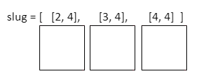

## Draw the slug

Your first job is to draw the slug on the Sense HAT's LED display. It is important to keep track of which pixels the slug is inhabiting so that you can move her around the screen. You will use a 2D list to store the coordinates of the pixels the slug is currently inhabiting.


[[[generic-python-2d-lists]]]

Your slug will begin by inhabiting three pixels on the LED display. Each pixel has a `x`, `y` coordinate which can be stored as a list, e.g. `[2, 4]`. The slug will inhabits three pixels, so it needs three coordinate lists. We will store the coordinate lists in another list, making a list of lists or a **2D list**.



Let's write the code that will draw the slug.

To be able to light up a pixel on the LED display, you need to specify three things: the x and y coordinates of the pixel, and the colour you would like the LED to be.

[[[rpi-sensehat-led-coordinates]]]

+ In the variables section of your file, create an empty list called `slug`.

[[[generic-python-create-list]]]

You will light up three pixels in a horizontal row to make up the slug. Each pixel's position will be represented as a list containing an x and a y coordinate.

+ Add the coordinate lists `[2, 4]`, `[3, 4]`, and `[4, 4]` (in that order) to your `slug` list to define the coordinates where the slug will start out. You have now created a 2D list, or a list of lists!

You also need to specify a colour for the slug.

+ In the variables section, create a variable to store the RGB colour of your slug. We chose white, but you can choose any colour you like.

```python
white = (255, 255, 255)
```

[[[generic-theory-colours]]]

+ In the functions section, create a function called `draw_slug()`. You will put the code to draw the slug into it.

[[[generic-python-simple-functions]]]

+ Inside your `draw_slug()` function, add a `for` loop to loop through each element in the `slug` list.

Each element in the list represents the `x, y` coordinates of one segment of the slug.

+ Inside the loop, use the `set_pixel` method to light up each pixel you specified in the `slug` list, thus drawing all segments of the slug.

--- hints ---
--- hint ---
The `set_pixel` method requires three arguments: the x coordinate of the pixel, the y coordinate of the pixel, and the colour.
--- /hint ---

--- hint ---
Your `for` loop will examine each segment of the slug in turn. If you wrote your loop like this:

```python
for segment in slug:
```
...then `segment[0]` will be the x coordinate of the segment you are currently looking at.
--- /hint ---

--- hint ---
Here is how your code might look:

```python
def draw_slug():
  for segment in slug:
      sense.set_pixel(segment[0], segment[1], white)
```
--- /hint ---
--- /hints ---

If you run your program at this point, nothing will happen. This is because you haven't called the function, and therefore the code will not execute.

+ In the **main program** section, clear the LED screen and then call the function by adding the following code:

```python
sense.clear()
draw_slug()
```

+ Save and run your program, and check that you see a row of three pixels light up to form your slug.
