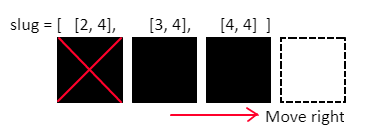

## Move the slug

Next, let's make the slug move. The slug is perpetually moving, so we need a way to store the last direction the player specified the slug should move.

+ In the variables section, create a variable called `direction`. The slug will begin the game moving right, so initialise this variable to the string `"right"`.

+ Also create a variable called `blank` which will contain the colour (0, 0, 0) so that we can delete pixels from the LED display.

We deliberately stored the pixel coordinates of the slug's current position in a list. To move the slug, we now need to follow this process:



+ Find the last item in the `slug` list
+ Find the next pixel in the `direction` the slug is currently moving
+ Add this pixel at the end of the slug list
+ Set this pixel to the slug's colour
+ Set the first pixel in the `slug` list to blank
+ Remove this pixel from the list

This algorithm works regardless of the direction chosen - the slug will simply bend round the corner!

The slug is actually a **queue** data structure.

Imagine the pixels of the slug are bits of food queuing up to be pooped out of the end of the slug and disappear. The first item in the list has reached the front of the queue and will exit the slug and be deleted. New pixels join the slug queue at the end (which is the mouth of the slug) and gradually work their way towards the front of the queue as the slug progresses.

+ In the functions section, create a function called `move()`

+ In the main program section, create an infinite loop which calls this function followed by a `sleep(0.5)`. This will eventually result in the slug perpetually moving across the screen.

[[[generic-python-while-true]]]

Here is some code to start off the `move()` function, but the code **does not work properly**.

+ Copy this code into your function and run the program. Look at what happens to the slug.

```python
def move():
  # Find the last and first items in the slug list
  last = slug[-1]
  first = slug[0]
  next = []

  # Find the next pixel in the direction the slug is currently moving
  if direction == "right":

    # Same row, next column along
    next = [last[0] + 1, last[1]]

  # Add this pixel at the end of the slug list
  slug.append(next)

  # Set the new pixel to the slug's colour
  sense.set_pixel(next[0], next[1], white)

  # Set the first pixel in the slug list to blank
  sense.set_pixel(first[0], first[1], blank)

  # Remove the first pixel from the list
  slug.remove(first)
```

+ Fix the code so that when the slug reaches the right hand wall, instead of the code crashing, the slug 'wraps' through the wall and reappears at the same place but on the opposite side of the screen.


--- hints ---

--- /hints ---

+ Add some more code to make the slug able to move up, down, left and right too. This code will be very similar to the code for moving right, but you'll need to work out which coordinate needs to change and whether to add or subtract one.
