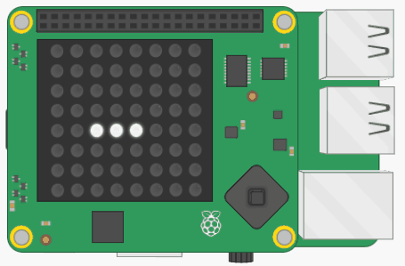

## Move the slug

Next, let's make the slug move. The slug is perpetually moving and only changes direction when the player specifies, so we need a way to store the last direction the player specified the slug should move.

+ In the variables section, create a variable called `direction`. The slug will begin the game moving right, so initialise this variable to the string `"right"`.

+ Also create a variable called `blank` which will contain the colour (0, 0, 0) so that we can delete pixels from the LED display.

We deliberately stored the pixel coordinates of the slug's current position in a list. To move the slug, we now need to follow this process:


+ Find the last item in the `slug` list (`[4, 4]`)
+ Find the next pixel in the `direction` the slug is currently moving (`[5, 4]`)
+ Add this pixel at the end of the slug list
+ Set this pixel to the slug's colour
+ Set the first pixel in the `slug` list (`[2, 4]`) to blank
+ Remove this pixel from the list

This algorithm works regardless of the direction chosen - the slug will simply bend round the corner!

The slug is actually a **queue** data structure.

--- collapse ---
---
title: What is a queue?
---
A queue is a data structure where the first piece of data added is the first data to come out - it is called a FIFO or "first in, first out" data structure. This is exactly like when you pay for your shopping: you join the queue at the back, and the person at the front gets to pay for their items first and then leaves the queue.

Imagine the pixels of the slug are bits of food queuing up to be pooped out of the end of the slug and disappear. The first item in the list has reached the front of the queue and will exit the slug and be deleted. New pixels join the slug queue at the end (which is the mouth of the slug) and gradually work their way towards the front of the queue as the slug progresses.
--- /collapse ---

+ In the functions section, create a function called `move()`

+ In the main program section, create an infinite loop which calls this function followed by a `sleep(0.5)`. This will eventually result in the slug perpetually moving across the screen.

[[[generic-python-while-true]]]

Here is some code to start off the `move()` function, but the code **does not work properly**.

+ Copy this code into your function and run the program. Look at what happens to the slug.

```python
def move():
  # Find the last and first items in the slug list
  last = slug[-1]
  first = slug[0]
  next = list(last)     # Create a copy of the last item

  # Find the next pixel in the direction the slug is currently moving
  if direction == "right":

    # Move along the column
    next[0] = last[0] + 1

  # Add this pixel at the end of the slug list
  slug.append(next)

  # Set the new pixel to the slug's colour
  sense.set_pixel(next[0], next[1], white)

  # Set the first pixel in the slug list to blank
  sense.set_pixel(first[0], first[1], blank)

  # Remove the first pixel from the list
  slug.remove(first)
```

+ Fix the code so that when the slug reaches the right hand wall, instead of the code crashing, the slug 'wraps' through the wall and reappears at the same place but on the opposite side of the screen.



--- hints ---
--- hint ---
Examine this code:
```python
# Move along the column
next[0] = last[0] + 1
```
If we always add on 1 to the `x` coordinate, eventually it will reach 8. The LED matrix only has LEDs 0-7 so 8 doesn't exist and causes the code to crash. How could you **check if** the **value + 1** would be 8, and instead, **set it to 0** to wrap around?
--- /hint ---

--- hint ---
Here is some pseudo code to help you:

**IF** last[0] + 1 **EQUALS** 8
   next[0] **EQUALS** 0
**ELSE**
   next[0] **EQUALS** last[0] + 1
--- /hint ---

--- hint ---
Here is how you code might look, but there are lots of different ways you could successfully write this code:

```python
# Move along the column
if last[0] + 1 == 8:
 next[0] = 0
else:
 next[0] = last[0] + 1
```
--- /hint ---
--- /hints ---

+ Add some more code to make the slug able to move up, down, left and right too. This code will be very similar to the code for moving right, but you'll need to work out which coordinate needs to change and whether to add or subtract one.

--- hints ---
--- hint ---
Add an `elif` to check whether the direction equals `"left"`. Then check whether moving the slug would result in the x coordinate being off the end of the LED matrix in this direction, i.e. `-1`. If it would, set the x coordinate to wrap around to `7` on the opposite side of the screen.

You can test your program by changing the value of the `direction` variable to `"left"`. Be aware that because this causes the slug to reverse, the slug may appear to behave oddly for the first few moves but will then behave normally.
--- /hint ---

--- hint ---
The up and down directions work exactly the same as left and right, except that you will be examining the `y` coordinate instead - `last[1]` and `next[1]`.
--- /hint ---

--- hint ---
Here is how your code might look. Again, there are lots of potential solutions so your code may be different but also work correctly:

```python
# Find the next pixel in the direction the slug is currently moving
 if direction == "right":
   if last[0] + 1 == 8:
     next[0] = 0
   else:
     next[0] = last[0] + 1

 elif direction == "left":
   if last[0] - 1 == -1:
     next[0] = 7
   else:
     next[0] = last[0] - 1

 elif direction == "down":
   if last[1] + 1 == 8:
     next[1] = 0
   else:
     next[1] = last[1] + 1

 elif direction == "up":
   if last[1] - 1 == -1:
     next[1] = 7
   else:
     next[1] = last[1] - 1
```

--- /hint ---
--- /hints ---
