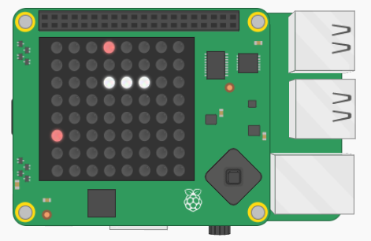

## Create vegetables

Our slug is hungry, so she needs something to eat! Let's generate some vegetables for her at random locations on the LED matrix.



Creating the vegetables is fairly straightforward:

1. Pick a random coordinate on the LED matrix
2. Check if this coordinate is where the slug currently is
3. If it is, repeat steps 1 and 2 until you pick a location that is outside the slug
4. Draw the vegetable on the LED matrix
5. Keep track of this vegetable's location in a list

The code you need is very similar code you've written earlier for the slug, so try to do this bit by yourself. If you get stuck, use the hints.

+ Create a new empty list called `vegetables` in your variables section.

+ Create a new function called `make_veg()` in your functions section.

+ Inside the function, write some code to pick a random coordinate on the LED matrix.

[[[generic-python-random]]]

--- hints ---
--- hint ---
Generate a random x coordinate and a random y coordinate and then put them together in a list. Both coordinates must be random numbers between 0 and 7.
--- /hint ---
--- hint ---
You can use the `randint` function to generate random numbers. For example, this code generates a random number between 5 and 10:

```python
a = randint(5, 10)
```
--- /hint ---
--- hint ---
Here is how your code should look:

```python
x = randint(0, 7)
y = randint(0, 7)
new = [x, y]
```
--- /hint ---
--- /hints ---


+ Check if this `x, y` coordinate is in the `slug` list. If it is, pick a new coordinate and check it again. Repeat this until the coordinate you pick isn't in the slug list.

[[[generic-python-item-in-list]]]

--- hints ---
--- hint ---
Here is some pseudocode to help you. We start off by setting `new` equal to the first coordinate in the `slug` list so that it is guaranteed to start off inside the slug, so a new coordinate must be generated.

Set `new` to the first coordinate in the `slug` list
**WHILE** the coordinate is in the `slug` list:
...**SET** x to a random number between 0 and 7
...**SET** y to a random number between 0 and 7
...**SET** new to x, y
--- /hint ---

--- hint ---
Here is how your code might look:

```python
new = slug[0]
while new in slug:
    x = randint(0, 7)
    y = randint(0, 7)
    new = [x, y]
```
--- /hint ---
--- /hints ---

+ Once you have found a coordinate which isn't inside the slug, draw the vegetable on the screen. Don't forget you'll also need to set up a new colour variable for the colour you want your vegetables to be.

[[[rpi-sensehat-single-pixel]]]

+ Add the coordinates of this vegetable to your `vegetables` list

[[[generic-python-append-list]]]

+ In your main program, call the `make_veg` function and check that vegetables are randomly inserted on the LED matrix.

You will probably notice that rather a lot of vegetables appear, and our slug will very quickly be overrun!


+ Add some code in the main program to only create a new vegetable if there are fewer than 3 vegetables currently in the `vegetables` list.

--- hints ---
--- hint ---
You can use the function `len()` to find out the length of the `vegetables` list, or in other words, how many items are in the list.
--- /hint ---
--- hint ---
Here is some pseudo code to help you:
**IF** the length of the vegetables list is **LESS THAN** 3
...**CALL** the `make_veg` function
--- /hint ---
--- hint ---
Here is how your code should look:

```python
if len(vegetables) < 3:
   make_veg()
```
--- /hint ---
--- /hints ---

### Challenge
Can you change your code so that if there are fewer than 3 vegetables in the list, there is only a 20% chance of creating a new vegetable each time so that the vegetables spawn more unpredictably. To create the 20% chance, randomly generate a number and then only create the vegetable for 1 in 5 of the numbers generated.

--- collapse ---
---
title: Challenge solution
---
```python
# Have a 20% chance of making a veggie if there aren't many about
if len(vegetables) < 3 and randint(1, 5) > 4:
    make_veg()
```

--- /collapse ---
