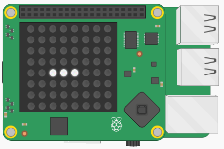
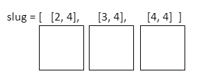

## Dibuja la babosa

Tu primera tarea será dibujar la babosa en la pantalla LED del Sense HAT. Es importante hacer un seguimiento de los pixeles en los que habita la babosa para que puedas moverla por la pantalla. Utilizarás una lista 2D para almacenar las coordenadas de los pixeles en los que habita actualmente la babosa.



[[[generic-python-2d-lists]]]

### ¿Cómo funcionará?

Tu babosa comenzará habitando tres pixeles en la pantalla LED. Cada pixel tiene una coordenada `x` y una coordenada `y` que pueden ser almacenadas como una lista, por ejemplo, `[2, 4]`. La babosa habitará tres pixeles, por lo que necesita tres listas de coordenadas. Almacenaremos las listas de coordenadas en otra lista, haciendo una lista de listas o una **lista 2D**.



### Escribe el código

Para poder iluminar un pixel en la pantalla LED, necesitas especificar tres cosas: las coordenadas x e y del pixel y el color que deseas que tenga el LED.

[[[rpi-sensehat-led-coordinates]]]

+ En la sección de variables de tu archivo, crea una lista vacía llamada `babosa`.

[[[generic-python-create-list]]]

Iluminarás tres pixeles en una fila horizontal para formar la babosa. La posición de cada pixel se representará como una lista que contiene una coordenada "x" y una coordenada "y".

+ Agrega las listas de coordenadas `[2, 4]`, `[3, 4]`, y `[4, 4]` (en ese orden) a tu lista `babosa` para definir las coordenadas desde donde la babosa comenzará a moverse. ¡Acabas de crear una lista 2D o una lista de listas!

También debes especificar un color para la babosa.

+ En la sección de variables, crea una variable para almacenar el color RGB de tu babosa. Nosotros elegimos el blanco, pero puedes elegir el color que desees.

```python
blanco = (255, 255, 255)
```

[[[generic-theory-colours]]]

+ En la sección de funciones, crea una función llamada `dibujar_babosa()`. Pondrás el código para dibujar la babosa en él.

[[[generic-python-simple-functions]]]

+ Dentro de tu función `dibujar_babosa()`, añade un bucle `for` para recorrer a través de cada elemento de la lista `babosa`.

Cada elemento en la lista representa las coordenadas `x, y` de un segmento de la babosa.

+ Dentro del bucle, usa el método `set_pixel` para iluminar cada pixel que especificaste en la lista `babosa`, dibujando así todos los segmentos de la babosa.

--- hints ---
--- hint ---

El método `set_pixel` requiere tres argumentos: la coordenada "x" del pixel, la coordenada "y" del pixel y el color.

--- /hint ---

--- hint ---

Tu bucle `for` examinará a su vez cada segmento de la babosa. Si escribiste tu bucle así:

```python
for segmento in babosa:
```

... entonces `segmento[0]` será la coordenada "x" del segmento que estás viendo actualmente.

--- /hint ---

--- hint ---

Así es como podría verse tu código:

```python
def dibujar_babosa():
  for segmento in babosa:
      sense.set_pixel(segmento[0], segmento[1], blanco)
```

--- /hint ---
--- /hints ---

Si ejecutas tu programa ahora, no pasará nada. Esto se debe a que no has llamado a la función y, por lo tanto, el código no se ejecutará.

+ En la sección **programa principal**, vacía la pantalla LED y luego llama a la función agregando el siguiente código:

```python
sense.clear()
dibujar_babosa()
```

+ Guarda y ejecuta tu programa, verificando que se encienda una fila de tres pixeles para formar tu babosa.
