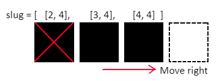
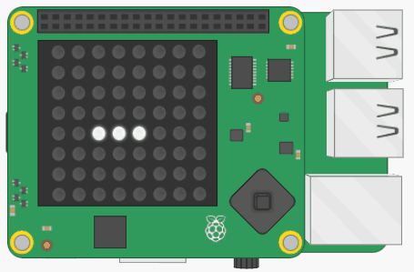

## Mueve la babosa

A continuación, hagamos que la babosa se mueva. La babosa siempre debe estar en movimiento, pero solo cambiará de dirección cuando el jugador lo especifique. Por lo tanto, debes almacenar la dirección en la que se mueve la babosa.

+ En la sección de variables, crea una variable llamada `direccion`. La babosa comenzará el juego moviéndose hacia la derecha, de modo que inicializa esta variable en la cadena `"derecha"`.

También necesitas una forma de "borrar" los pixeles para poder apagar un LED una vez que la babosa haya seguido adelante.

+ Crea una variable llamada `vacio` y configúrala con el color RGB `(0, 0, 0)`.

Dado que almacenaste las coordenadas de pixeles de la posición actual de la babosa en una lista, ahora puedes seguir este proceso para mover la babosa:



+ Encuentra el último elemento en la lista `babosa` (`[4, 4]`)
+ Find the next pixel in the `direction` in which the slug is currently moving (`[5, 4]`)
+ Agrega este pixel al final de la lista `babosa`
+ Configura este pixel al color de la babosa
+ Configura el primer pixel en la lista `babosa` (`[2, 4]`) como `vacio`
+ Elimina este pixel de la lista

Este algoritmo funciona incluso cuando el jugador cambia la dirección de la babosa. Cuando eso sucede, el cuerpo de la babosa simplemente se doblará para apuntar en la nueva dirección.

La babosa es en realidad una estructura de datos **cola**.

--- collapse ---
---
título: ¿Qué es una cola?
---

Una cola es una estructura de datos donde el primer dato agregado es el primer dato que sale. También es llamada una estructura de datos PEPS o "primero en entrar, primero en salir" (FIFO en inglés). Es como esperar en la fila de un supermercado para pagar tus compras: te unes a la cola en la parte de atrás, y la persona en la parte delantera tiene que pagar primero sus artículos y luego deja la cola.

Imagina que los pixeles de la babosa son trozos de comida haciendo cola para ser expulsados de la babosa. El primer elemento de la lista está al principio de la cola, que es la parte posterior de la babosa: este elemento saldrá de la babosa y se eliminará. Nuevos pixeles se unen al final de la cola de la babosa, que es donde está la boca de la babosa. Poco a poco se abren camino hacia el frente de la cola a medida que se mueve la babosa.

--- /collapse ---

+ En la sección de funciones, crea una función llamada `mover()`.

+ En la sección principal del programa, crea un bucle infinito que llame a esta función seguido de `sleep(0.5)`. Una vez que hayas escrito el código para la función, este bucle hará que la babosa se mueva continuamente por la pantalla.

[[[generic-python-while-true]]]

Aquí hay algo de código para iniciar la función `mover()`. **No** funciona correctamente aún.

+ Copia este código en tu función y ejecuta el programa. Usamos la variable de color `blanco` para la babosa, por lo que si eliges un nombre de variable diferente, deberás asegurarte de estar usando el nombre correcto en la función.

```python
def mover():
  # Encontrar el último y el primer elemento en la lista babosa
  ultimo = babosa[-1]
  primero = babosa[0]
  siguiente = lista(ultimo)     # Crea una copia del último elemento

  # Encontrar el siguiente pixel en la dirección en la que la babosa se mueve actualmente
  if direcciun == "derecha":

    # Mover a lo largo de la columna
    siguiente[0] = ultimo[0] + 1

  # Añadir este pixel al final de la lista babosa
  babosa.append(siguiente)

  # Configurar el nuevo pixel con el color de la babosa
  sense.set_pixel(siguiente[0], siguiente[1], blanco)

  # Configurar el primer pixel en la lista como vacío
  sense.set_pixel(primero[0], primero[1], vacio)

  # Eliminar el primer pixel de la lista
  babosa.eliminar(primero)
```

+ Ejecuta el programa y observa lo que le sucede a la babosa. ¿Puedes explicar por qué estás viendo lo que estás viendo?

+ Arregla el código para que cuando la babosa llegue a la pared de la derecha, "se mueva" a través de ella y reaparezca en la misma coordenada "y" pero en el lado opuesto de la pantalla.



--- hints --- --- hint ---

Examina este código:

```python
# Mover a lo largo de la columna
siguiente[0] = último[0] + 1
```

Si siempre agregamos 1 a la coordenada "x", finalmente llegará a 8. La matriz LED solo tiene LEDs del 0 al 7 a lo largo de cada eje; 8 no existe, por lo que el código falla. ¿Cómo podrías verificar que el valor de la coordenada "x" más 1 sea igual a 8 y, en ese caso, configurarlo a 0 para que la babosa se mueva a través de la pared?

--- /hint ---

--- hint ---

Aquí hay un pseudocódigo para ayudarte:

`si` ultimo[0] + 1 `es igual a` 8 configurar siguiente[0] como 0 `si no` configurar siguiente[0] como ultimo[0] + 1

--- /hint ---

--- hint ---

Así es como se vería tu código, pero hay muchas maneras diferentes en las que podrías escribir esta sección con éxito:

```python
# Mover a lo largo de la columna
if ultimo[0] + 1 == 8:
 siguiente[0] = 0
else:
 siguiente[0] = ultimo[0] + 1
```

--- /hint --- --- /hints ---

+ Agrega un poco más de código para que la babosa también pueda moverse hacia arriba, hacia abajo y hacia la izquierda. Este código será muy similar al código para moverse hacia la derecha, pero necesitarás determinar qué coordenada debe cambiar y si debes aumentar o disminuir su valor.

--- hints --- --- hint ---

Añade una condicional `elif` para verificar si la dirección es igual a `"izquierda"`. Luego verifica si mover la babosa daría como resultado que el valor de la coordenada "x" esté fuera de la matriz LED, por ejemplo, `-1`. Si ese es el caso, configura la coordenada "x" como `7` para que la babosa vuelva a aparecer en el lado opuesto de la pantalla.

Puedes probar tu programa cambiando el valor de la variable `direccion` `"izquierda"`. Nota: debido a que esto hace que la babosa se revierta, puede parecer que la babosa se comporta de manera extraña durante los primeros movimientos, pero luego se comportará normalmente.

--- /hint ---

--- hint ---

El código para las direcciones "arriba" y "abajo" funciona exactamente igual que el de "izquierda" y "derecha", excepto que, en su lugar, estarás examinando la coordenada "y": `ultimo[1]` y `siguiente[1]`.

--- /hint ---

--- hint ---

Así es como podría verse tu código. Nuevamente, hay muchas soluciones potenciales, por lo que tu código puede verse diferente y funcionar correctamente de todos modos.

```python
# Encontrar el siguiente pixel en la dirección en la que se mueve la babosa actualmente
 if direccion == "derecha":
   if ultimo[0] + 1 == 8:
     siguiente[0] = 0
   else:
     siguiente[0] = ultimo[0] + 1

 elif direccion == "izquierda":
   if ultimo[0] - 1 == -1:
     siguiente[0] = 7
   else:
     siguiente[0] = ultimo[0] - 1

 elif dirección == "abajo":
   if ultimo[1] + 1 == 8:
     siguiente[1] = 0
   else:
     siguiente[1] = ultimo[1] + 1

 elif dirección == "arriba":
   if ultimo[1] - 1 == -1:
     siguiente[1] = 7
   else:
     siguiente[1] = ultimo[1] - 1
```

--- /hint --- --- /hints ---

--- collapse ---
---
título: Una forma más eficiente
---

El código sugerido en la pista anterior es bastante ineficiente: hay mucha repetición. Una posible forma diferente de resolver este problema sería primero sumar o restar el valor de la coordenada, independientemente de si hacerlo crea una coordenada fuera del borde de la matriz LED. Luego, antes de realizar cualquier acción con la nueva coordenada, ejecútala a través de una función `envolver()` para verificar si está fuera del borde y, de ser así, reposiciónala. Tu función podría verse así:

```python
def envolver(pix):
    # Envolver la coordenada x
    if pix[0] > 7:
        pix[0] = 0
    if pix[0] < 0:
        pix[0] = 7
    # Envolver la coordenada y
    if pix[1] < 0:
        pix[1] = 7
    if pix[1] > 7:
        pix[1] = 0

    return pix
```

--- /collapse ---
