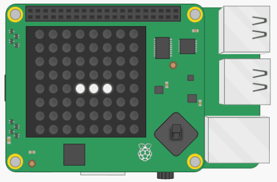

## Usa la palanca de mando

A continuación, conectemos la palanca de mando del Sense HAT para que el jugador pueda controlar el movimiento de la babosa.



+ En la sección de funciones, crea una nueva función:

```python
def palanca_de_mando_movida(event):
```

Llamarás a esta función cada vez que la palanca de mando se mueva. Recibirá automáticamente un parámetro llamado `event`, que te permitirá saber en qué dirección se movió la palanca de mando.

Necesitarás configurar la variable `direccion` en la dirección en la que se movió la palanca de mando. Para poder cambiar el valor de la variable desde dentro de esta función, debes especificar `global` para la variable. Para averiguar por qué, lee sobre el alcance de las funciones de Python.

[[[generic-python-function-scope]]]

+ Añade `global direccion` a tu función:

```python
def palanca_de_mando_movida(event):
    global direccion
```

Puedes acceder a la dirección en la que se movió la palanca de mando con la ayuda del parámetro `event`: usa el comando `event.direction`.

+ Dentro de tu función, configura la variable `direccion` para que sea igual a `event.direction`.

+ Finalmente, en la sección principal de tu programa, escribe una línea de código para decir que, cuando se mueva la palanca de mando del Sense HAT en cualquier dirección, se llame a la función `palanca_de_mando_movida`.

[[[rpi-python-sensehat-joystick-event-functions]]]

--- hints --- --- hint ---

Puedes averiguar cómo hacer esto en la sección de información "Activación de llamadas de función con la palanca de mando de Sense HAT" que se encuentra arriba.

--- /hint ---

--- hint ---

El código para decir "cuando se presione la palanca de mando en cualquier dirección" es el siguiente:

```python
sense.stick.direction_any =
```

--- /hint ---

--- hint ---

Así es como debería verse el código en el **programa principal**:

```python
sense.stick.direction_any = palanca_de_mando_movida
```

Aquí está el código completo de la **función**:
```python
def palanca_de_mando_movida(event):
    global direccion
    direccion = event.direction
```

--- /hint ---

--- /hints ---

+ Ejecuta tu programa y prueba si funciona. Si estás usando el emulador, puedes simular el movimiento de la palanca de mando presionando las teclas de flecha en tu teclado.

En este momento, es posible mover la babosa hacia atrás "a través" de ella misma, lo que parece bastante extraño. Más adelante agregaremos un código que hará que el juego termine si la babosa se muerde a sí misma, por lo que no hay necesidad de preocuparse por resolver este problema técnico.
