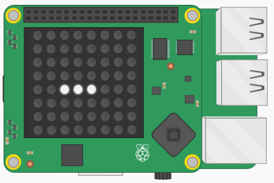

## Dessiner la limace

Ta première tâche consiste à dessiner la limace sur l'écran LED du Sense HAT. Il est important de garder la trace des pixels occupés par la limace afin de pouvoir la déplacer sur l'écran. Tu utiliseras une liste 2D pour stocker les coordonnées des pixels que la limace occupe actuellement.



[[[generic-python-2d-lists]]]

### Comment cela fonctionnera-t-il ?

Ta limace commencera par occuper trois pixels sur l'écran LED. Chaque pixel a une coordonnée `x`, `y` qui peut être stockée sous forme de liste, par exemple `[2, 4]`. La limace occupera trois pixels, elle a donc besoin de trois listes de coordonnées. Nous stockerons les listes de coordonnées dans une autre liste, en faisant une liste de listes ou une **liste 2D**.


### Écrire le code

Pour pouvoir allumer un pixel sur l'écran LED, tu dois spécifier trois choses : les coordonnées x et y du pixel, et la couleur que tu souhaites donner à la LED.

[[[rpi-sensehat-led-coordinates]]]

+ Dans la section des variables de ton fichier, crée une liste vide appelée `limace`.

[[[generic-python-create-list]]]

Tu allumeras trois pixels dans une rangée horizontale pour constituer la limace. La position de chaque pixel sera représentée sous la forme d'une liste contenant une coordonnée x et y.

+ Ajoute les listes de coordonnées `[2, 4]`, `[3, 4]` et `[4, 4]` (dans cet ordre) à ta liste `limace` pour définir les coordonnées avec lesquelles la limace commencera. Tu as maintenant créé une liste 2D, ou une liste de listes !

Tu dois également spécifier une couleur pour la limace.

+ Dans la section des variables, crée une variable pour stocker la couleur RVB de ta limace. Nous avons choisi le blanc, mais tu peux choisir la couleur de ton choix.

```python
blanc = (255, 255, 255)
```

[[[generic-theory-colours]]]

+ Dans la section des fonctions, crée une fonction appelée `dessiner_limace()`. Tu y mettras le code pour dessiner la limace.

[[[generic-python-simple-functions]]]

+ Dans ta fonction `dessiner_limace()`, ajoute une boucle `for` pour parcourir chaque élément de la liste `limace`.

Chaque élément de la liste représente les coordonnées `x, y` d'un segment de la limace.

+ À l'intérieur de la boucle, utilise la méthode `set_pixel` pour éclairer chaque pixel que tu as spécifié dans la liste `limace`, dessinant ainsi tous les segments de la limace.

--- hints ---
--- hint ---

La méthode `set_pixel` nécessite trois arguments : la coordonnée x du pixel, la coordonnée y du pixel et la couleur.

--- /hint ---

--- hint ---

Ta boucle `for` examinera tour à tour chaque segment de la limace. Si tu as écrit ta boucle comme ceci :

```python
for segment in limace:
```

...alors `segment[0]` sera la coordonnée x du segment que tu regardes actuellement.

--- /hint ---

--- hint ---

Voici à quoi ton code pourrait ressembler :

```python
def dessiner_limace():
  for segment in limace:
      sense.set_pixel(segment[0], segment[1], blanc)
```

--- /hint ---
--- /hints ---

Si tu exécutes ton programme à ce stade, rien ne se passera. C'est parce que tu n'as pas appelé la fonction, et donc le code ne s'exécutera pas.

+ Dans la section **programme principal**, efface l'écran LED puis appelle la fonction en ajoutant le code suivant :

```python
sense.clear()
dessiner_limace()
```

+ Enregistre et exécute ton programme, et vérifie que tu vois une rangée de trois pixels s'allumer pour former ta limace.
