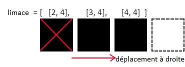

## Déplacer la limace

Ensuite, déplaçons la limace. La limace doit toujours être en mouvement, mais elle ne changera de direction que lorsque le joueur le spécifiera. Par conséquent, tu dois stocker la direction dans laquelle la limace se déplace.

+ Dans la section des variables, crée une variable appelée `direction`. La limace commencera le jeu en se déplaçant vers la droite, initialise donc cette variable à la chaîne `"right"`.

Tu as également besoin d'un moyen d '«effacer» les pixels afin de pouvoir éteindre une LED une fois que la limace s'est déplacée.

+ Crée une variable appelée `vide`, et mets-la à la couleur RVB `(0, 0, 0)`.

Puisque tu as stocké les coordonnées en pixel de la position actuelle de la limace dans une liste, tu peux maintenant suivre ce processus pour déplacer la limace :



+ Trouver le dernier élément dans la liste `limace` (`[4, 4]`)
+ Trouver le pixel suivant dans la `direction` dans laquelle la limace se déplace actuellement (`[5, 4]`)
+ Ajouter ce pixel à la fin de la liste `limace`
+ Mettre ce pixel sur la couleur de la limace
+ Mettre le premier pixel de la liste `limace` (`[2, 4]`) à `vide`
+ Retirer ce pixel de la liste

Cet algorithme fonctionne même lorsque le joueur change la direction de la limace. Lorsque cela se produit, le corps de la limace se pliera simplement pour aller dans la nouvelle direction.

La limace est en fait une structure de données **file d'attente**.

--- collapse ---
---
title: Qu'est-ce qu'une file d'attente ?
---

Une file d'attente est une structure de données où la première donnée ajoutée est la première donnée à sortir. Elle est également appelée structure de données FIFO ou « premier entré, premier sorti ». C'est comme attendre dans un supermarché pour payer tes courses : tu rejoins la file d'attente à l'arrière, et la personne à l'avant paie d'abord ses articles, puis quitte la file d'attente.

Imagine que les pixels de la limace sont des morceaux de nourriture faisant la queue pour être expulsés de la limace. Le premier élément de la liste se trouve au début de la file d'attente, c'est-à-dire à l'arrière de la limace : cet élément sortira de la limace et sera supprimé. De nouveaux pixels rejoignent la file d'attente de limace à la fin, là où se trouve la bouche de la limace. Ils se dirigent progressivement vers l'avant de la file d'attente au fur et à mesure que la limace se déplace.

--- /collapse ---

+ Dans la section des fonctions, crée une fonction appelée `deplace()`.

+ Dans la section principale du programme, crée une boucle infinie qui appelle cette fonction suivie d'un `sleep(0.5)`. Une fois que tu as écrit le code de la fonction, cette boucle fera que la limace se déplacera continuellement sur l'écran.

[[[generic-python-while-true]]]

Voici un code pour démarrer la fonction `deplace()`. Elle ne **fonctionne pas** correctement.

+ Copie ce code dans ta fonction et exécute le programme. Nous avons utilisé la variable de couleur `blanc` pour la limace, donc si tu as choisi un nom de variable différent, tu devras t'assurer que tu utilises le bon nom dans la fonction.

```python
def deplace():
  # Trouver le dernier et le premier element de la liste limace
  dernier = limace[-1]
  premier = limace[0]
  suivant = list(dernier) # Creer une copie du dernier element

  # Trouver le pixel suivant dans la direction dans laquelle la limace se deplace actuellement
  if direction == "right":

    # Se deplacer le long de la colonne
    suivant[0] = dernier[0] + 1

  # Ajouter ce pixel a la fin de la liste des limaces
  limace.append(suivant)

  # Definir le nouveau pixel sur la couleur de la limace
  sense.set_pixel(suivant[0], suivant[1], blanc)

  # Definir le premier pixel de la liste des limaces sur vide
  sense.set_pixel(premier[0], premier[1], vide)

  # Supprimer le premier pixel de la liste
  limace.remove(premier)
```

+ Exécute le programme et regarde ce qui arrive à la limace. Peux-tu expliquer pourquoi tu vois ce que tu vois ?

+ Corrige le code de sorte que, lorsque la limace atteint le mur de droite, elle « traverse » le mur et réapparaît à la même coordonnée y mais du côté opposé de l'écran.


--- hints --- --- hint ---

Examine ce code :

```python
# Se deplacer le long de la colonne
suivant[0] = dernier[0] + 1
```

Si nous ajoutons toujours 1 à la coordonnée x, elle finira par atteindre 8. La matrice LED n'a que les LED 0-7 le long de chaque axe - 8 n'existe pas, c'est pourquoi le code se bloque. Comment pourrais-tu vérifier si la valeur de la coordonnée x plus 1 serait 8 et, dans ce cas, la régler sur 0 à la place pour que la limace se déplace à travers le mur ?

--- /hint ---

--- hint ---

Voici un pseudo-code pour t'aider :

`si` dernier[0] + 1 `est égal à` 8 définit suivant[0] sur 0 `sinon` définit suivant[0] sur le dernier[0] + 1

--- /hint ---

--- hint ---

Voici à quoi ton code pourrait ressembler, mais il existe de nombreuses façons différentes d'écrire cette section avec succès :

```python
# Se deplacer le long de la colonne
if dernier[0] + 1 == 8 :
 prochain[0] = 0
else :
 suivant[0] = dernier[0] + 1
```

--- /hint --- --- /hints ---

+ Ajoute un peu plus de code pour que la limace puisse également se déplacer vers le haut, vers le bas et vers la gauche. Ce code sera très similaire au code pour se déplacer vers la droite, mais tu devras déterminer quelle coordonnée modifier et s'il faut augmenter ou réduire sa valeur.

--- hints --- --- hint ---

Ajoute une instruction `elif` pour vérifier si la direction est égale à `"left"`. Vérifie ensuite si le déplacement de la limace entraînerait la valeur de la coordonnée x en dehors de la matrice LED, par exemple `-1`. Si tel est le cas, règle la coordonnée x sur `7` pour faire réapparaître la limace sur le côté opposé de l'écran.

Tu peux tester ton programme en changeant la valeur de la variable `direction` sur `"left"`. Remarque : étant donné que cela provoque l'inversion de la limace, la limace peut sembler se comporter bizarrement pendant les premiers mouvements, mais elle se comportera ensuite normalement.

--- /hint ---

--- hint ---

Le code pour les directions haut et bas fonctionne exactement de la même manière que pour gauche et droite, sauf que tu examineras la coordonnée y à la place : `dernier[1]` et `suivant[1]`.

--- /hint ---

--- hint ---

Voici à quoi ton code pourrait ressembler . Encore une fois, il existe de nombreuses solutions potentielles, de sorte que ton code peut sembler différent et fonctionner correctement de toute façon.

```python
# Trouver le pixel suivant dans la direction dans laquelle la limace se deplace actuellement
 if direction == "right":
   if dernier[0] + 1 == 8:
     suivant[0] = 0
   else:
     suivant[0] = dernier[0] + 1

 elif direction == "left":
   if dernier[0] - 1 == -1 :
     prochain[0] = 7
   else :
     prochain[0] = dernier[0] - 1

 elif direction == "down":
   if dernier[1] + 1 = = 8 :
[1] suivants = 0
   else :
[1] suivants = dernier[1] + 1

 direction elif == "up" :
   if dernier[1] - 1 == -1 :
[1] suivants = 7
   else :
[1] suivants =[1] derniers - 1
```

--- /hint --- --- /hints ---

--- collapse ---
---
title: Une façon plus efficace
---

Le code suggéré dans l'astuce précédente est plutôt inefficace : il y a beaucoup de répétitions. Une manière différente possible de résoudre ce problème serait d'abord d'ajouter ou de soustraire de la valeur de coordonnée, que cela crée ou non une coordonnée située à l'extérieur du bord de la matrice LED. Ensuite, avant d'effectuer toute action avec la nouvelle coordonnée, exécute-la via une fonction `envelopper()` pour vérifier si elle est hors du bord et si c'est le cas, repositionne-la. Ta fonction pourrait ressembler à ceci :

```python
def envelopper(pix):
    # Envelopper la coordonnée x
    if pix[0] > 7:
        pix[0] = 0
    if pix[0] < 0:
        pix[0] = 7
    # Envelopper la coordonnée y
    if pix[1] < 0:
        pix[1] = 7
    if pix[1] > 7:
        pix[1] = 0

    return pix
```

--- /collapse ---
