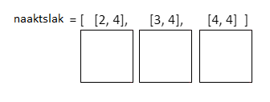

## Teken de naaktslak

Je eerste taak is om de naaktslak op het LED-display van de Sense HAT te tekenen. Het is belangrijk om bij te houden welke pixels de naaktslak bewoont, zodat je haar over het scherm kunt bewegen. Je gebruikt een 2D-lijst om de coördinaten op te slaan van de pixels die de slak momenteel bewoont.


[[[generic-python-2d-lists]]]

### Hoe gaat het in zijn werk?

Je naaktslak begint met drie pixels op het LED-scherm. Elke pixel heeft een `x`, `y` coördinaat die kan worden opgeslagen als een lijst, bijvoorbeeld `[2, 4]`. De slak bewoont drie pixels, dus het heeft drie coördinatenlijsten nodig. We slaan de coördinatenlijsten op in een andere lijst en maken een lijst met lijsten of een **2D-lijst**.



### Schrijf de code

Om een pixel op het LED-display te laten oplichten, moet je drie dingen opgeven: de x- en y-coördinaten van de pixel en de kleur die je wilt dat de LED is.

[[[rpi-sensehat-led-coordinates]]]

+ Maak in het gedeelte met variabelen van je bestand een lege lijst met de naam `naaktslak`.

[[[generic-python-create-list]]]

Je licht drie pixels op in een horizontale rij om de naaktslak te vormen. De positie van elke pixel wordt weergegeven als een lijst met een x- en een y-coördinaat.

+ Voeg de coördinatenlijsten `[2, 4]`, `[3, 4]`en `[4, 4]` (in die volgorde) toe aan je `naaktslak` lijst om de coördinaten te definiëren waar de naaktslak begint. Je hebt nu een 2D-lijst of een lijst met lijsten gemaakt!

Je moet ook een kleur opgeven voor de slak.

+ Maak in het gedeelte met variabelen een variabele om de RGB-kleur van je slak op te slaan. We hebben gekozen voor wit, maar je kunt elke gewenste kleur kiezen.

```python
wit = (255, 255, 255)
```

[[[generic-theory-colours]]]

+ Maak in de sectie Functies de functie `teken_naaktslak()`. Je plaatst de code om de naaktslak erin te tekenen.

[[[generic-python-simple-functions]]]

+ Voeg in je `teken_naaktslak()` functie een `for` lus toe om elk element in de `naaktslak` lijst te doorlopen.

Elk element in de lijst vertegenwoordigt de `x, y` coördinaten van één segment van de slak.

+ In de lus gebruik `set_pixel` methode oplichten elke pixel opgegeven in de `slug` lijst, waardoor alle segmenten van de prop tekening.

--- hints --- --- hint ---

De methode `set_pixel` vereist drie argumenten: de x-coördinaat van de pixel, de y-coördinaat van de pixel en de kleur.

--- /hint ---

--- hint ---

Je `for` lus onderzoekt elk segment van de slak op zijn beurt. Als je je lus als volgt hebt geschreven:

```python
for segment in naaktslak:
```

... dan is `segment[0]` de x-coördinaat van het segment dat je momenteel bekijkt.

--- /hint ---

--- hint ---

Zo ziet je code eruit:

```python
def teken_naaktslak():
  for segment in naaktslak:
      sense.set_pixel(segment[0], segment[1], wit)
```

--- /hint --- --- /hints ---

Als je je programma op dit punt uitvoert, gebeurt er niets. Dit komt omdat je de functie niet hebt aangeroepen en daarom de code niet wordt uitgevoerd.

+ Wis in de sectie **hoofdprogramma** het LED-scherm en roep vervolgens de functie op door de volgende code toe te voegen:

```python
sense.clear()
teken_naaktslak()
```

+ Sla je programma op en voer het uit en controleer of een rij van drie pixels oplicht om je naaktslak te vormen.
