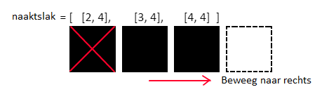

## Verplaats de slak

Laten we vervolgens de slak bewegen. De slak moet altijd in beweging zijn, maar deze zal alleen van richting veranderen als de speler dit aangeeft. Daarom moet je de richting opslaan waarin de naaktslak beweegt.

+ Maak in de sectie met variabelen een variabele met de naam `richting`. De slak begint het spel naar rechts te bewegen, dus initialiseer deze variabele met de string `"right"`.

Je hebt ook een manier nodig om pixels te 'wissen', zodat je een LED kunt uitschakelen zodra de naaktslak is verplaatst.

+ Maak een variabele met de naam `leeg` en stel deze in op RGB-kleur `(0, 0, 0)`.

Omdat je de pixelcoördinaten van de huidige positie van de naaktslak in een lijst hebt opgeslagen, kun je nu dit proces volgen om de slak te verplaatsen:



+ Zoek het laatste item in de `naaktslak` lijst (`[4, 4]`)
+ Zoek de volgende pixel in de `richting` in welke de naaktslak momenteel beweegt (`[5, 4]`)
+ Voeg deze pixel toe aan het einde van de `naaktslak` lijst
+ Stel deze pixel in op de kleur van de slak
+ Stel de eerste pixel in de `naaktslak` lijst (`[2, 4]`) in op `leeg`
+ Verwijder deze pixel uit de lijst

Dit algoritme werkt zelfs wanneer de speler de richting van de slak verandert. Wanneer dat gebeurt, buigt het lichaam van de naaktslak eenvoudig om in de nieuwe richting te wijzen.

De slak is eigenlijk een **wachtrij** gegevensstructuur.

--- collapse ---
---
title: Wat is een wachtrij?
---

Een wachtrij is een gegevensstructuur waarbij het eerste stukje gegevens dat wordt toegevoegd het eerste stuk gegevens is dat eruit komt. Het wordt ook een FIFO of 'first in, first out' (eerste in, eerste uit) datastructuur genoemd. Dit is hetzelfde als wachten in een supermarkt om te betalen voor je boodschappen: je gaat achteraan in de rij staan en de persoon vooraan in de rij mag als eerste zijn items betalen en verlaat dan de rij.

Stel je voor dat de pixels van de slak stukjes voedsel zijn die in de rij staan om uit de slak te worden gepoept. Het eerste item in de lijst staat aan de voorkant van de wachtrij, dat is de achterkant van de slak: dit item verlaat de slak en wordt verwijderd. Nieuwe pixels voegen zich toe aan het einde van de slakkenwachtrij, waar zich de opening van de slak bevindt. Ze werken zich geleidelijk naar de voorkant van de rij terwijl de slak beweegt.

--- /collapse ---

+ Maak in de sectie Functies een functie met de naam `beweeg()`.

+ Maak in het hoofdprogramma een oneindige lus die deze functie aanroept, gevolgd door een `sleep(0.5)`. Nadat je de code voor de functie hebt geschreven, zal deze lus de slak continu over het scherm laten bewegen.

[[[generic-python-while-true]]]

Hier is wat code om de functie `beweeg()` te starten. Het werkt **nog niet** goed.

+ Kopieer deze code naar je functie en voer het programma uit. We hebben de kleurvariabele `wit` voor de naaktslak gebruikt, dus als je een andere variabelenaam kiest, moet je ervoor zorgen dat je de juiste naam in de functie gebruikt.

```python
def beweeg():
  # Zoek de laatste en eerste items in de naaktslaklijst
  laatste = naaktslak[-1]
  eerste = naaktslak[0]
  volgende = list(laatste) # Maak een kopie van het laatste item

  # Zoek de volgende pixel in de richting die de slak momenteel beweegt
  if richting == "right":

    # Beweeg langs de kolom
    volgende[0] = laatste[0] + 1

  # Voeg deze pixel toe aan het einde van de naaktslakkenlijst
  naaktslak.append(volgende)

  # Zet de nieuwe pixel op de kleur van de naaktslak
  sense.set_pixel(volgende[0], volgende[1], wit)

  # Zet de eerste pixel in de naaktslaklijst op blanco
  sense.set_pixel(eerste[0], eerste[1], leeg)

  # Verwijder de eerste pixel uit de lijst
  naaktslak.remove(eerste)
```

+ Start het programma en kijk wat er met de naaktslak gebeurt. Kun je uitleggen waarom je ziet wat je ziet?

+ Repareer de code zodanig dat, wanneer de slak de rechterwand bereikt, ze door de muur 'beweegt' en weer op dezelfde y-coördinaat verschijnt, maar aan de andere kant van het scherm.


--- hints --- --- hint ---

Bekijk deze code:

```python
# Ga langs de kolom
volgende[0] = laatste[0] + 1
```

Als we altijd 1 toevoegen aan de x-coördinaat, zal deze uiteindelijk 8 bereiken. De LED-matrix heeft alleen LED's 0-7 langs elke as - 8 bestaat niet, daarom crasht de code. Hoe kun je controleren of de waarde van de x-coördinaat plus 1 8 is en in dat geval op 0 zetten om de naaktslak door de muur te laten bewegen?

--- /hint ---

--- hint ---

Hier is wat pseudocode om je te helpen:

`als` laatste[0] + 1 `gelijk is aan` 8 stel volgende[0] in op 0 `anders` stel volgende[0] in op laatste[0] + 1

--- /hint ---

--- hint ---

Hier is hoe je code eruit zou kunnen zien, maar er zijn veel verschillende manieren waarop je deze sectie met succes kunt schrijven:

```python
# Beweeg langs de kolom
if laatste[0] + 1 == 8:
 volgende[0] = 0
else:
 volgende[0] = laatste[0] + 1
```

--- /hint --- --- /hints ---

+ Voeg nog wat code toe zodat de slak ook omhoog, omlaag en naar links kan bewegen. Deze code lijkt erg op de code om naar rechts te gaan, maar je moet uitzoeken welke coördinaat je moet wijzigen en of je de waarde groter of kleiner moet maken.

--- hints --- --- hint ---

Voeg een `elif` statement toe om te controleren of de richting gelijk is aan `"left"`. Controleer vervolgens of het verplaatsen van de slak ertoe zou leiden dat de waarde van de x-coördinaat buiten de LED-matrix komt, bijvoorbeeld `-1`. Als dat het geval is, stel je de x-coördinaat in op `7` om de slak weer aan de andere kant van het scherm te laten verschijnen.

Je kunt je programma testen door de waarde van de variabele `richting` te wijzigen in `"left"`. Opmerking: omdat hierdoor de slak achteruitgaat, kan de slak zich de eerste paar bewegingen vreemd gedragen, maar zich dan normaal gedragen.

--- /hint ---

--- hint ---

De code voor de richtingen omhoog en omlaag werkt precies hetzelfde als die voor links en rechts, behalve dat je in plaats daarvan de y-coördinaat onderzoekt: `laatste[1]` en `volgende[1]`.

--- /hint ---

--- hint ---

Hier is hoe je code eruit zou kunnen zien. Nogmaals, er zijn veel mogelijke oplossingen, dus je code kan er anders uitzien en toch correct werken.

```python
# Zoek de volgende pixel in de richting waarin de naaktslak momenteel beweegt
 if richting == "right":
   if laatste[0] + 1 == 8:
     volgende[0] = 0
   else:
     volgende[0] = laatste[0] + 1

 elif richting == "left":
   if laatste[0] - 1 == -1:
     volgende[0] = 7
   else:
     volgende[0] = laatste[0] - 1

 elif richting == "down":
   if laatste[1] + 1 == 8:
     volgende[1] = 0
   else:
     volgende[1] = laatste[1] + 1

 elif richting == "up":
   if laatste[1] - 1 == -1:
     volgende[1] = 7
   else:
     volgende[1] = laatste[1] - 1
```

--- /hint --- --- /hints ---

--- collapse ---
---
title: Een efficiëntere manier
---

De in de vorige hint voorgestelde code is vrij inefficiënt: er is veel herhaling. Een mogelijke andere manier om dit probleem op te lossen zou zijn om eerst de coördinaatwaarde toe te voegen of af te trekken, ongeacht of hierdoor een coördinaat ontstaat die buiten de rand van de LED-matrix ligt. Voer vervolgens, voordat je acties met de nieuwe coördinaat uitvoert, laat een `wikkel()` functie er op los die controleert of deze buiten de rand ligt en zo ja, deze verplaatst. Je functie kan er ongeveer zo uitzien:

```python
def wikkel(pix):
    # Wikkel x coordinaat
    if pix[0] > 7:
        pix[0] = 0
    if pix[0] < 0:
        pix[0] = 7
    # Wikkel y coordinaat
    if pix[1] < 0:
        pix[1] = 7
    als pix[1] > 7:
        pix[1] = 0

    return pix
```

--- /collapse ---
