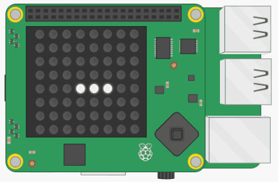

## Maak groenten

Onze naaktslak heeft honger, dus ze heeft iets te eten nodig! Laten we wat groenten voor haar genereren op willekeurige locaties op de LED-matrix.


Het maken van de groenten is vrij eenvoudig:

1. Kies een willekeurige coördinaat van `x, y` op de LED-matrix
2. Controleer of deze coördinaat momenteel wordt bewoond door de naaktslak
3. Als dit het geval is, herhaal je stap 1 en 2 totdat je een locatie kiest die zich buiten de naaktslak bevindt
4. Teken de groente op de LED-matrix

De code die je nodig hebt, lijkt sterk op de code die je eerder voor de slak hebt geschreven, dus probeer dit stukje zelf te doen. Gebruik de hints als je vastloopt.

+ Maak een nieuwe variabele om de kleur te definiëren van de groenten die je gaat maken. Je kunt dit op dezelfde manier doen als je de kleur van je naaktslak hebt gedefinieerd.

### Creëer de functie

+ Definieer een nieuwe functie met de naam `make_veg ()` in je functiegedeelte. De code om in de functie te plaatsen wordt in de volgende stappen uitgelegd.

+ Schrijf binnen de functie wat code om een willekeurige coördinaat op de LED-matrix te kiezen.

[[[generic-python-random]]]

--- hints --- --- hint ---

Genereer een willekeurige x-coördinaat en een willekeurige y-coördinaat en plaats ze vervolgens in een lijst. Beide coördinaten moeten willekeurige getallen tussen 0 en 7 zijn.

--- /hint --- --- hint ---

Je kunt de functie `randint` gebruiken om willekeurige getallen te genereren. Deze code genereert bijvoorbeeld een willekeurig getal tussen 5 en 10:

```python
a = randint(5, 10)
```

--- /hint --- --- hint ---

Dit is hoe je code eruit zou moeten zien:

```python
x = randint(0, 7)
y = randint(0, 7)
nieuw = [x, y]
```

--- /hint --- --- /hints ---


+ Controleer of deze `x, y` coördinaat in de `naaktslak` lijst staat. Als dit het geval is, kies dan een nieuwe coördinaat en vergelijk deze met de lijst. Herhaal dit totdat de gekozen coördinaat niet in de lijst met slakken voorkomt.

[[[generic-python-item-in-list]]]

--- hints --- --- hint ---

Hier is wat pseudocode om je te helpen. We beginnen met het instellen van `nieuw` gelijk aan de eerste coördinaat in de `naaktslak` lijst zodat het gegarandeerd in de slak begint. Op deze manier moet minimaal één keer een nieuwe coördinaat worden gegenereerd.

Stel `nieuw` in op de eerste coördinaat in de `naaktslak` lijst `terwijl` de coördinaat in de `naaktslak` lijst staat: stel x in op een willekeurig getal tussen 0 en 7 stel y in op een willekeurig getal tussen 0 en 7 zet `nieuw` in op x, y

--- /hint ---

--- hint ---

Zo ziet je code eruit:

```python
nieuw = naaktslak[0]
while nieuw in naaktslak:
    x = randint(0, 7)
    y = randint(0, 7)
    nieuw = [x, y]
```

--- /hint --- --- /hints ---

+ Zodra je een coördinaat van `x, y` hebt gevonden die zich niet in de slak bevindt, teken je de groente op het scherm met je nieuwe kleurvariabele.

### Roep de functie aan

+ Roep in je hoofdprogramma de functie `maak_groente` aan en controleer of groenten willekeurig verschijnen op de LED-matrix.

Je zult waarschijnlijk merken dat er nogal wat groenten verschijnen, dus je slak wordt snel overschreven!



Je hebt een manier nodig om bij te houden hoeveel groenten er zijn, zodat je deze gevaarlijke verspreiding van groenten kunt voorkomen!

## Blijf op de hoogte van de groenten

+ Maak een nieuwe lege lijst met de naam `groenten` in je variabelensectie.

+ Schrijf een coderegel aan het einde van je `maak_groente` functie om de coördinaten van de nieuwe groente toe te voegen aan je `groenten` lijst.

[[[generic-python-append-list]]]

+ Wijzig de manier waarop je de functie `maak_groente` in het hoofdprogramma aanroept, zodat deze alleen een nieuwe groente maakt als er minder dan drie items in de lijst met `groenten` staan.

--- hints --- --- hint ---

Je kunt de functie `len()` gebruiken om de lengte van de `groenten` lijst te achterhalen, of met andere woorden, hoeveel items er in de lijst staan.

--- /hint --- --- hint ---

Hier is wat pseudocode om je te helpen:

`als` de lengte van de groentenlijst `minder dan` 3 Roep de `maak_groente` functie aan

--- /hint --- --- hint ---

Dit is hoe je code eruit zou moeten zien:

```python
if len(groenten) < 3:
   maak_groente()
```

--- /hint --- --- /hints ---

### Uitdaging
Kun je je code zo wijzigen dat, als er minder dan 3 groenten in de lijst staan, er slechts 20% kans is om een nieuwe groente te maken elke keer dat de functie wordt uitgevoerd? Dit maakt het minder voorspelbaar wanneer groenten kunnen verschijnen. Om een kans van 20% te creëren, kies je willekeurig een getal tussen 1 en 5 en maak je alleen een groente voor een specifiek getal in dit bereik.

--- collapse ---
---
title: Uitdagingsoplossing
---

```python
# Laat er een kans van 20% zijn op het maken van een groente als er niet veel zijn
if len(groenten) < 3 and randint (1, 5) > 4:
    maak_groente()
```

--- /collapse ---
