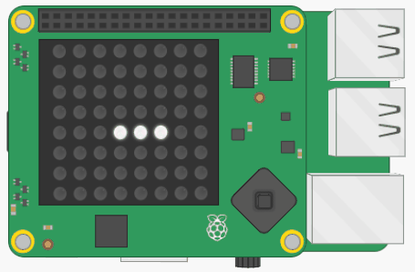

## Create vegetables

Our slug is hungry, so she needs something to eat! Let's generate some vegetables for her at random locations on the LED matrix.


Creating the vegetables is fairly straightforward:

1. Pick a `x, y` random coordinate on the LED matrix
2. Check if this coordinate is currently inhabited by the slug
3. If it is, repeat steps 1 and 2 until you pick a location that is outside the slug
4. Draw the vegetable on the LED matrix

The code you need is very similar code you've written earlier for the slug, so try to do this bit by yourself. If you get stuck, use the hints.

+ Create a new variable to define the colour of the vegetables you're going to make. You can do this in the same way you defined the colour of your slug.

### Create the function

+ Define a new function called `make_veg()` in your functions section. The code to put inside the function is explained in the following steps.

+ Inside the function, write some code to pick a random coordinate on the LED matrix.

[[[generic-python-random]]]

--- hints --- --- hint --- Generate a random x coordinate and a random y coordinate and then put them together in a list. Both coordinates must be random numbers between 0 and 7. --- /hint --- --- hint --- You can use the `randint` function to generate random numbers. For example, this code generates a random number between 5 and 10:

```python
a = randint(5, 10)
```
--- /hint --- --- hint --- Here is how your code should look:

```python
x = randint(0, 7)
y = randint(0, 7)
new = [x, y]
```
--- /hint --- --- /hints ---


+ Check if this `x, y` coordinate is in the `slug` list. If it is, pick a new coordinate and check it against the list. Repeat this until the coordinate you've picked isn't in the slug list.

[[[generic-python-item-in-list]]]

--- hints --- --- hint --- Here is some pseudocode to help you. We start off by setting `new` equal to the first coordinate in the `slug` list so that it is guaranteed to start off inside the slug. This way a new coordinate must be generated at least once.

Set `new` to the first coordinate in the `slug` list `while` the coordinate is in the `slug` list: set x to a random number between 0 and 7 set y to a random number between 0 and 7 set `new` to x, y --- /hint ---

--- hint --- Here is how your code might look:

```python
new = slug[0]
while new in slug:
    x = randint(0, 7)
    y = randint(0, 7)
    new = [x, y]
```
--- /hint --- --- /hints ---

+ Once you have found an `x, y` coordinate which isn't inside the slug, draw the vegetable on the screen using your new colour variable.

### Call the function

+ In your main program, call the `make_veg` function and check that vegetables randomly appear on the LED matrix.

You will probably notice that rather a lot of vegetables appear, so your slug is quickly overrun!



You need a way to track how many vegetables there are, so that you can prevent this dangerous spreading of veggies!

## Keep track of the vegetables

+ Create a new empty list called `vegetables` in your variables section.

+ Write a line of code at the end of your `make_veg` function to add the coordinates of the new vegetable to your `vegetables` list.

[[[generic-python-append-list]]]

+ Change the way you call the `make_veg` function in the main program so that it will only create a new vegetable if there are fewer than three items in the `vegetables` list.

--- hints --- --- hint --- You can use the function `len()` to find out the length of the `vegetables` list, or in other words, how many items are in the list. --- /hint --- --- hint --- Here is some pseudocode to help you:

`if` the length of the vegetables list is `less than` 3 Call the `make_veg` function --- /hint --- --- hint --- Here is how your code should look:

```python
if len(vegetables) < 3:
   make_veg()
```
--- /hint --- --- /hints ---

### Challenge
Can you change your code so that, if there are fewer than 3 vegetables in the list, there is only a 20% chance of creating a new vegetable each time the function runs? This will make it less predictable when vegetables might appear. To create the 20% chance, randomly pick a number between 1 and 5, and only create a vegetable for one specific number in this range.

--- collapse ---
---
title: Challenge solution
---
```python
# Let there be a 20% chance of making a veggie if there aren't many about
if len(vegetables) < 3 and randint(1, 5) > 4:
    make_veg()
```

--- /collapse ---
